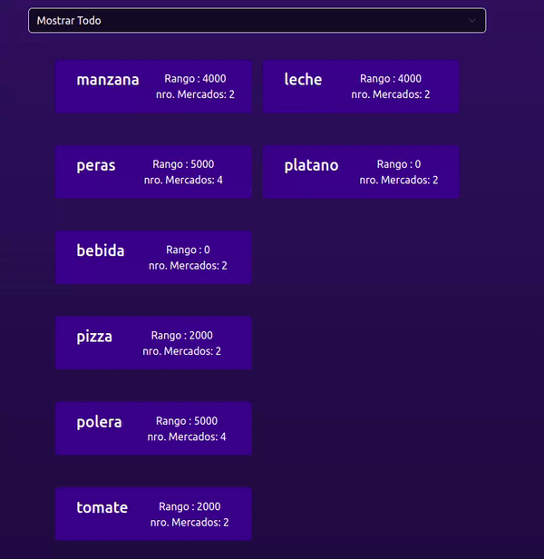

# Learning React
This is meant for learning purposes,The main pont  of this  work  is  use React Hooks.

## Displaying  Data  using React 
It is a simple React app that displays data from a JSON file. Given a filter, it displays the data that matches the filter, eliminating all mismatches every one second.

